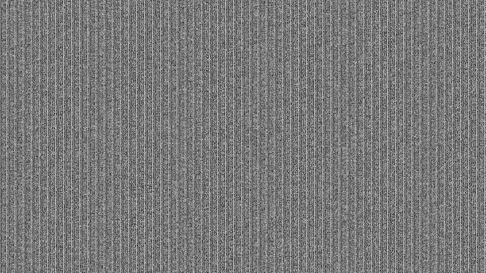

# JSON-to-MP4 Pixel Matrix Encoding and Decoding

This repository contains Python scripts for encoding JSON data into an MP4 video's pixel matrix and decoding the hidden data back to JSON.

## Requirements

- Python
- OpenCV (cv2)
- NumPy
- Pillow (PIL)

## Usage

### Encoding (encode.py)

1. Place your JSON data in the `data/data.json` file.
2. Run `encode.py` to convert the JSON data into an encoded MP4 video.
3. Encoded frames will be saved in the `frames` directory.
4. The final encoded video will be stored as `output/output_video.mp4`.

### Decoding (decode.py)

1. Run `decode.py` to decode the hidden data from the encoded MP4 video.
2. The decoded JSON data will be saved in `output/results.json`.

## Important Notes

- Adjust parameters like `frame_width`, `frame_height`, and `fps` as needed.
- Make sure to install the required libraries using `pip install opencv-python numpy Pillow`.

## Example of data matrix

## Credits

These scripts were created to showcase JSON-to-MP4 steganography by Gabriel Bravo Eguren.
